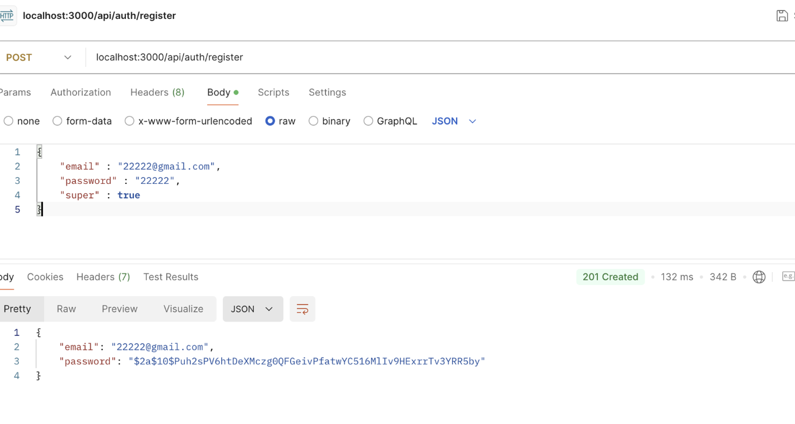
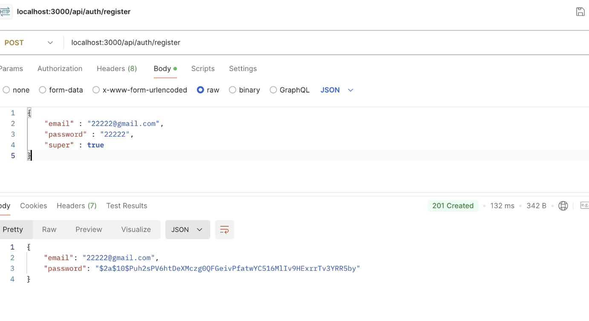
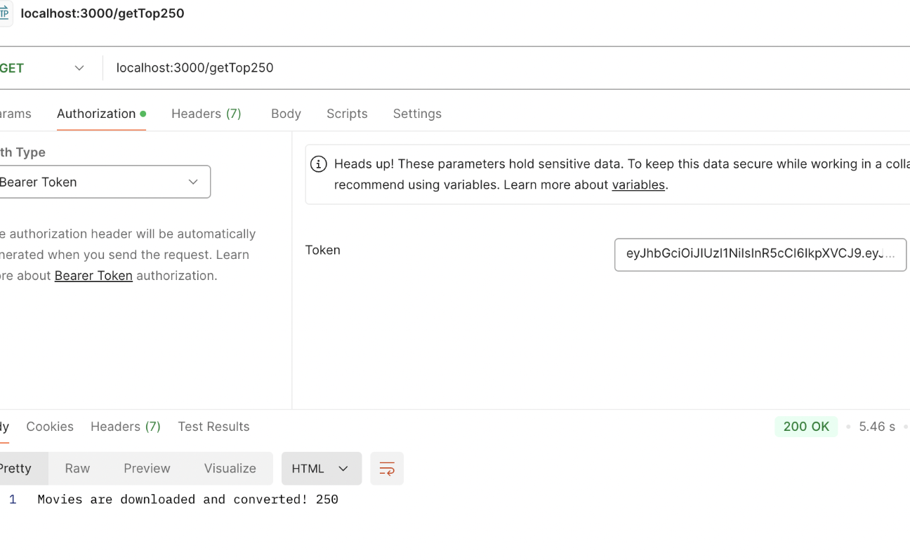
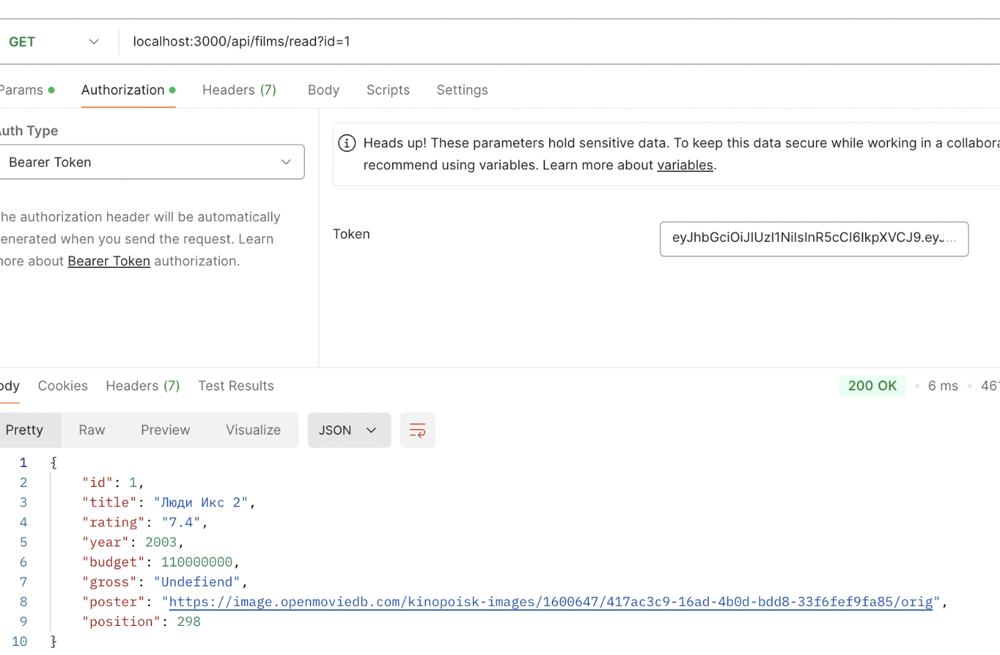
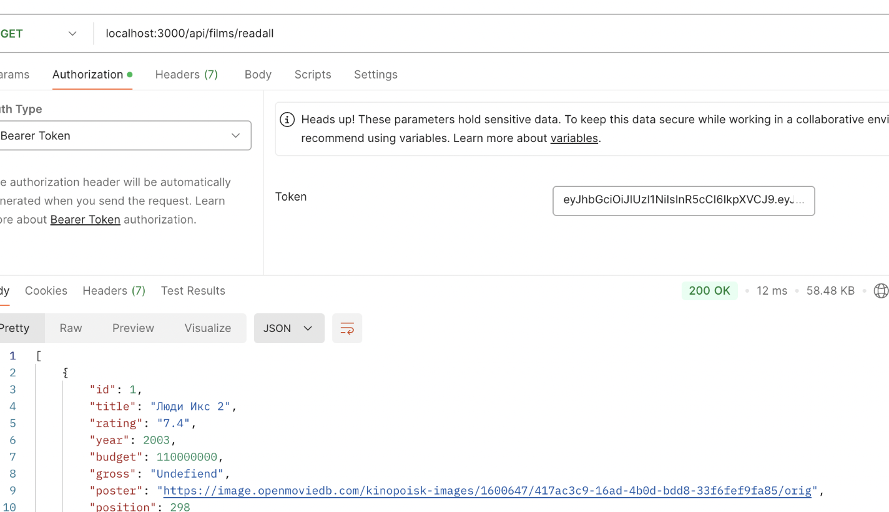
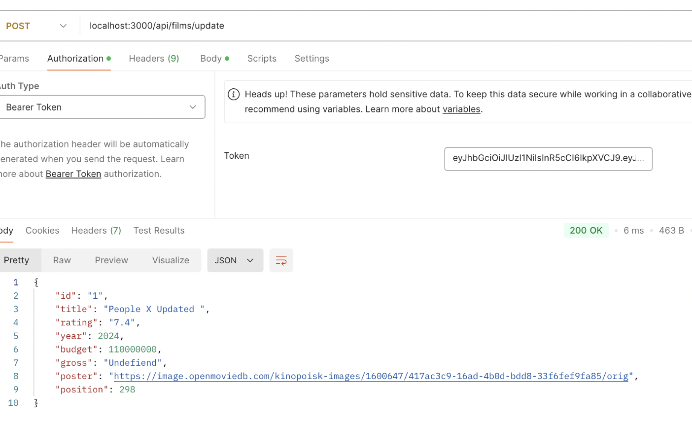

This project is a web application using Express.js, providing an API for user (manager) 
management and movie data. It includes registration, authentication, and CRUD operations for movies.

/auth/register – Registers new users by hashing their passwords using bcrypt.
/auth/login – Authenticates users, checks the password, and generates a JWT token using jsonwebtoken.

Passwords are hashed with bcrypt.
Tokens are generated and used to verify access rights (valid for 5 minutes).
Differentiates between regular users and superusers, assigning different permissions.

/getTop250 – Fetches and saves a list of the top 250 movies from Kinopoisk API.
/films/readall – Retrieves a list of all movies.
/films/read – Fetches a specific movie's details by its ID.
/films/create – Adds a new movie (validates the required fields).
/films/update – Updates movie details by its ID.
/films/delete – Deletes a movie by ID and updates the remaining movies' indexes.

Middleware: checkAuthHeader checks for the presence and validity of the JWT token in requests that are not related to authentication.
Based on the user role (superuser or regular user), different permissions are granted (e.g., superusers can create and 
delete movies, while regular users can only read them).

Middleware: createLog logs every request to a file (./files/logs.txt), including the timestamp, URL, method, request 
body, and authorization header.

Express.js, bcrypt, jsonwebtoken, axios, fs

